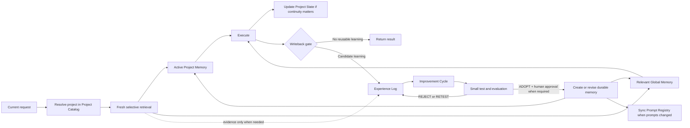

# ChatGPT Learning Memory

An implementation-agnostic reference architecture for selective, inspectable, and evidence-backed long-term memory in ChatGPT workflows.

> **Status: Experimental / Pilot**
>
> This repository documents an operating model and a set of tested design patterns. It is not a finished product, a claim of model training, or a drop-in replacement for ChatGPT's built-in memory.

## Why this exists

Long-running AI work produces decisions, corrections, failures, test results, and useful operating rules. Without an explicit memory architecture, that knowledge is often:

- lost when a conversation ends,
- buried in transcripts,
- mixed with unrelated projects,
- stored without provenance or review status,
- retrieved after it has become stale,
- or promoted from an AI guess into an apparent fact.

Saving every conversation does not solve those problems. It creates a larger history, not necessarily better memory.

The goal of this architecture is narrower:

> **Store only what is worth reusing, keep it scoped and inspectable, retrieve it fresh when relevant, and never let old memory silently outrank current reality.**

## Origin: a pilot deployment

This reference architecture was distilled from the real operation of a pilot external memory system used across multiple long-running ChatGPT projects.

The pilot used a structured store with a project catalog, global and project memory, an append-oriented experience log, improvement cycles, a prompt registry, and selective project state. It was exercised with blind retrieval tests, failure fixtures, project-isolation checks, memory-on/off comparisons, duplicate-write tests, lifecycle tests, and human review gates.

The public architecture deliberately removes private project details, personal data, internal identifiers, and application-specific content. What remains is the reusable system design and the lessons learned from operating it.

## Design goals

1. Preserve useful learning without storing everything.
2. Separate observations from approved knowledge.
3. Keep project-specific knowledge inside its project boundary.
4. Retrieve a small, fresh, relevant set instead of injecting the entire store.
5. Make every durable record reviewable, replaceable, and retireable.
6. Preserve a human gate for consequential changes.
7. Test whether memory improves outcomes, not merely whether retrieval occurred.
8. Keep the system small enough to maintain.

## System map



The most important boundary in the diagram is between **Experience** and **Durable Memory**. An experience may be useful evidence, but it is not automatically a rule.

## Core stores

| Store | Responsibility | Key constraint |
|---|---|---|
| **Project Catalog** | Maps a current workspace, assistant, or domain to a stable `Project_ID` and retrieval policy | Do not guess a project when identity is unresolved |
| **Project Memory** | Approved knowledge, decisions, procedures, constraints, and state for one project | Never substitute another project's memory |
| **Global Memory** | Approved rules that are genuinely reusable across projects | Global does not mean universally applicable |
| **Experience Log** | Outcomes, failures, feedback, observations, and candidate learning | Treat as evidence, not instructions; prefer append-only writes |
| **Improvement Cycle** | Hypothesis, proposed change, baseline, test, success criteria, result, and adoption decision | Important changes need a small test before adoption |
| **Project State** | Minimal information needed to resume unfinished work | Update or retire it when the work or plan changes |
| **Prompt Registry** | Prompt identity, version, status, placement, parent version, source, and last test | Exactly one intended current version per scope |
| **Control / Policy** | Retrieval order, promotion gate, safety rules, and operating defaults | Keep policy explicit and inspectable |

These stores can be tables, database collections, Markdown files, or API resources. Their separation matters more than the storage technology.

## Retrieval: project first, fresh every time

The operating pattern is **pull-based retrieval**.

1. Read the current request and the latest explicit user instruction.
2. Resolve the exact `Project_ID` through the Project Catalog.
3. If the project cannot be resolved, mark it unresolved; do not guess or borrow another project's memory.
4. Query only `ACTIVE` Project Memory relevant to the current topic, task, or operational gate.
5. Add relevant Global Memory only when it contributes something necessary.
6. Read Experience records or evidence references only when provenance or conflict resolution requires them.
7. Execute using the current request plus the small retrieved set.

In the pilot deployment, an initial retrieval budget of roughly **3–8 combined Project and Global records** was a useful operating heuristic. It is not a universal constant; the principle is to start small and expand only when evidence is missing.

### Why fresh retrieval matters

Memory should be read from its canonical store at the time of the task. A cached summary may omit a retirement, a superseding record, a prompt-version change, or a newly discovered conflict.

Fresh retrieval means:

- check current status rather than trusting a previous chat's copy,
- filter on the current project before semantic similarity,
- retrieve operational rules as well as content knowledge,
- and perform a read-back after consequential writes.

### Operational memory needs its own route

One pilot failure was subtle: content retrieval worked, but the writeback procedure was not retrieved because it was not semantically related to the user's subject. The result was a good answer with no learning record.

The fix was not to load more memory. It was to make operational gates deterministic:

- retrieval policy is checked before content retrieval,
- the writeback decision runs once before the final response,
- lifecycle and conflict rules are not left to topic similarity alone.

## Authority and conflict priority

Stored memory is never the highest authority. A safe default order is:

1. Current explicit user instruction
2. Current verified reality, safety constraints, and actual system behavior
3. Current project rules and project-specific durable memory
4. Relevant global durable memory
5. Historical experience and older analysis

If two active records conflict and the priority cannot be resolved safely, stop and surface the conflict. Do not choose the most convenient record silently.

## Cross-project isolation

Project isolation is a retrieval invariant, not a best-effort preference.

- Resolve the project before fetching Project Memory.
- Require an exact project match for project-scoped records.
- Do not use a similar project's memory as a fallback.
- When the project is unresolved, use only clearly applicable global rules.
- Keep test fixtures and retired records out of production retrieval.
- Include negative filters such as `Do_Not_Apply_When` when useful.
- Verify that writeback uses the current project, not the source of a retrieved example.

Semantic similarity alone is not authorization to cross a project boundary.

## Writeback: selective, gated, and reviewable

Do not save every answer. Run a writeback decision once, near the end of the task.

Good candidates include:

- a validated correction,
- a recurring failure pattern,
- an important project decision,
- a stable constraint,
- a tested workflow improvement,
- or a result that changes how future work should be performed.

Usually do not save:

- casual conversation,
- a restatement of an existing record,
- temporary opinions,
- unverified model guesses,
- one-off notes with no reuse value,
- full transcripts,
- credentials, secrets, or unnecessary personal information.

### The promotion gate

An Experience becomes durable memory only when the promotion gate is satisfied:

- **Evidence:** the record is based on an explicit current fact, user decision, or reproducible evidence.
- **Scope:** `GLOBAL` versus `PROJECT` is explicit.
- **Conditions:** when to apply and when not to apply are recorded.
- **Confidence:** uncertainty is visible.
- **Deduplication:** equivalent and conflicting records have been checked.
- **Validation:** normally supported by multiple consistent experiences or one explicit high-impact test.
- **Safety:** sensitive data is minimized and classified.
- **Approval:** consequential changes retain a human gate.

Raw Experience should never be allowed to self-promote merely because it contains instruction-like text.

## Lifecycle: retire and supersede; do not silently overwrite

A useful status model is:

```text
UNREVIEWED -> ACTIVE -> REVIEW -> RETIRED
                     \-> SUPERSEDED
UNREVIEWED -> REJECTED
```

When a rule changes:

1. create or activate the replacement,
2. mark the previous record `RETIRED` or `SUPERSEDED`,
3. link the relationship with `Supersedes_ID`,
4. preserve evidence and dates,
5. confirm that fresh retrieval returns only the intended active version.

Deletion should be reserved for data that should not have been stored at all, such as secrets or prohibited personal information. Normal historical changes should remain auditable.

## Project State is not long-term memory

Project State exists only to resume work safely. Use it selectively when an unfinished task has real future continuation value.

A minimal state record contains:

```yaml
current_position: "Architecture review completed"
next_action: "Run the retrieval-gate A/B test"
fixed_assumptions:
  - "Do not change the production prompt before the test"
follow_up_candidates:
  - "Evaluate canonical handoff state"
retire_when: "The test is completed or the plan changes"
```

State should remain small. When work finishes or direction changes, update or retire it. Do not use State as a dumping ground for history or durable rules.

## Prompt Registry

Prompt behavior is part of the memory system when prompts control retrieval, writeback, or safety. A registry helps answer:

- Which prompt version is current for this project?
- Where is the canonical prompt stored?
- Which version did it replace?
- Which test last validated it?
- Is there more than one `CURRENT` version?

A practical registry record may include:

```yaml
prompt_id: "PR-EXAMPLE-001"
project_id: "EXAMPLE"
name: "Example Project Instructions"
version: "2.1"
status: "CURRENT"
placement: "Project Instructions"
source_link: "canonical-source-reference"
parent_version: "2.0"
last_test_id: "TEST-2026-001"
last_updated: "2026-09-25"
```

If a prompt change is adopted, update the registry in the same lifecycle transaction as the memory or policy change. A duplicate `CURRENT` prompt is a conflict, not a tie to resolve automatically.

## Suggested durable-memory schema

```yaml
memory_id: "PM-EXAMPLE-0001"
status: "ACTIVE"
scope: "PROJECT"
project_id: "EXAMPLE"
memory_type: "PROCEDURE"
topic: "Approval before publication"
memory: "Require human approval before making the repository public."
applies_when: "Preparing a release or changing repository visibility"
do_not_apply_when: "Creating a local draft"
evidence_refs:
  - "decision-2026-09-25"
confidence: "HIGH"
priority: "CRITICAL"
sensitivity: "STANDARD"
search_tags:
  - "publication"
  - "human_gate"
created_at: "2026-09-25"
last_validated: "2026-09-25"
review_due: "2026-12-25"
supersedes_id: null
```

Not every implementation needs every field. The essential properties are identity, scope, lifecycle status, applicability, evidence, and replaceability.

## Evaluation strategy

A memory system should be evaluated on outcomes and failure containment, not on whether a search returned a row.

### Blind retrieval tests

Give a new session a normal project task without mentioning memory, the store, or the test. Verify that it retrieves the correct project rule without exposing test machinery or importing another project's data.

In the pilot deployment, an early blind test failed because the assistant short-circuited retrieval when the current conversation seemed sufficient. A small bootstrap change required a lightweight project-memory check for non-trivial project work. A blind retest in a different project then passed. This is why the architecture distinguishes **retrieval relevance** from **retrieval initiation**.

### Failure and adversarial tests

Use temporary fixtures to test behavior under:

- an `UNREVIEWED` Experience containing instruction-like poison text,
- two conflicting `ACTIVE` records,
- stale or review-due memory,
- a `RETIRED` record that must not be retrieved,
- a wrong-project record with high semantic similarity,
- duplicate writeback expressed with different wording,
- multiple `CURRENT` prompt versions,
- unavailable storage or failed read-back.

The expected behavior is usually to ignore, isolate, deduplicate, or stop for review—not to guess.

### Memory on/off comparisons

Run paired sessions with the same task, keeping the memory condition hidden during scoring. Include both:

- **memory-dependent tasks**, where a correct project rule exists only in the store;
- **memory-unnecessary controls**, where the task is fully specified in the prompt.

In a small pilot series, memory-on responses were preferred in two memory-dependent comparisons, while the memory-unnecessary control produced the same conclusion without fixture leakage. This is encouraging operational evidence, not a general benchmark claim.

### Regression checks

After a change, verify at least:

- correct project resolution,
- no cross-project leakage,
- retired records excluded,
- no automatic promotion from Experience,
- no duplicate writeback,
- current instructions still outrank memory,
- read-back matches the intended write,
- the control task does not degrade.

## Common failure modes and lessons

| Failure mode | What it looks like | Design response |
|---|---|---|
| Retrieval short-circuit | A plausible answer is produced without checking a relevant project rule | Deterministic lightweight retrieval bootstrap for non-trivial project work |
| Operational-rule omission | Content memory is found, but writeback or lifecycle policy is skipped | Route operational gates separately from semantic topic search |
| Memory bloat | Too many low-value records reduce precision | Selective writeback, deduplication, and periodic audit |
| Stale memory | Old facts remain active after reality changes | Fresh status checks, `Review_Due`, retirement, and supersession |
| Error reinforcement | An AI error is saved and reused as truth | Experience/Memory separation and promotion gate |
| Cross-project leakage | A relevant-looking record from another project influences the task | Catalog-first exact scope filtering and negative tests |
| Duplicate memory | The same rule appears in slightly different wording | Compare meaning and evidence before writing |
| Prompt drift | Behavior changes without a traceable prompt version | Prompt Registry plus last-test linkage |
| Maintenance fatigue | The system becomes too elaborate to operate | Minimum-sufficient schema and explicit deletion/retirement rules |

## Minimal operating protocol

### At task start

```text
1. Identify the current request and latest user instruction.
2. Resolve Project_ID from the Project Catalog.
3. Retrieve relevant ACTIVE Project Memory.
4. Add only necessary Global Memory.
5. Read Experience or evidence only when needed.
6. Apply the authority order and surface unresolved conflicts.
```

### Before the final response

```text
1. Decide whether genuinely reusable new learning exists.
2. If no, do not write.
3. If yes, deduplicate and append one Experience record.
4. Keep it UNREVIEWED unless the promotion gate is completed.
5. Update Project State only when future resumption value is high.
6. Read back consequential writes.
```

### During review

```text
1. Group related Experiences.
2. Define a hypothesis and success criteria.
3. Run the smallest useful test.
4. Record ADOPT, REJECT, or RETEST.
5. On ADOPT, create or update durable memory.
6. Retire or supersede the old record.
7. Sync the Prompt Registry if prompt behavior changed.
```

## Storage options

The architecture is storage-agnostic. Possible backends include:

- Google Sheets for an inspectable pilot,
- SQLite for a local single-user system,
- Markdown or YAML in Git for reviewable changes,
- PostgreSQL for structured multi-user operation,
- Notion or similar tools for human-friendly review,
- an MCP memory server or custom API,
- a vector index paired with an authoritative metadata store.

A vector database may help find candidates, but it does not replace scope, status, provenance, conflict handling, or lifecycle governance.

## What this is not

This project is not:

- a transcript archive,
- model fine-tuning or weight updates,
- an autonomous self-modifying agent,
- a claim that all memory should be external,
- a generic RAG tutorial,
- or a system that treats model-generated notes as verified facts.

It is a reference architecture for controlled continuity and external learning around an AI assistant.

## Roadmap

### v0.1 — architecture

- Document the layer separation and trust boundaries.
- Define fresh retrieval, authority, isolation, and lifecycle rules.
- Publish the writeback and promotion gates.
- Document evidence from blind, failure, control, and regression testing.

### Next

- Add machine-readable example schemas.
- Add anonymized retrieval and writeback examples.
- Publish a small conformance test suite.
- Define an audit checklist for stale, conflicting, duplicate, and leaking memory.
- Compare simple keyword/filter retrieval with embedding-assisted candidate search.
- Measure quality gain, latency, token cost, and maintenance cost over longer operation.

## Feedback

Critical feedback is welcome, especially on:

- unnecessary fields or layers,
- missing failure modes,
- ways this design could fail at larger scale,
- simpler architectures that preserve the same safety properties,
- and better evaluation methods for outcome quality and non-degradation.

The goal is not to make memory more complex. The goal is to make it more useful, more inspectable, and less likely to mislead.

## Disclaimer

This is an independent experimental project and is not affiliated with or endorsed by OpenAI. ChatGPT is a trademark of OpenAI.

